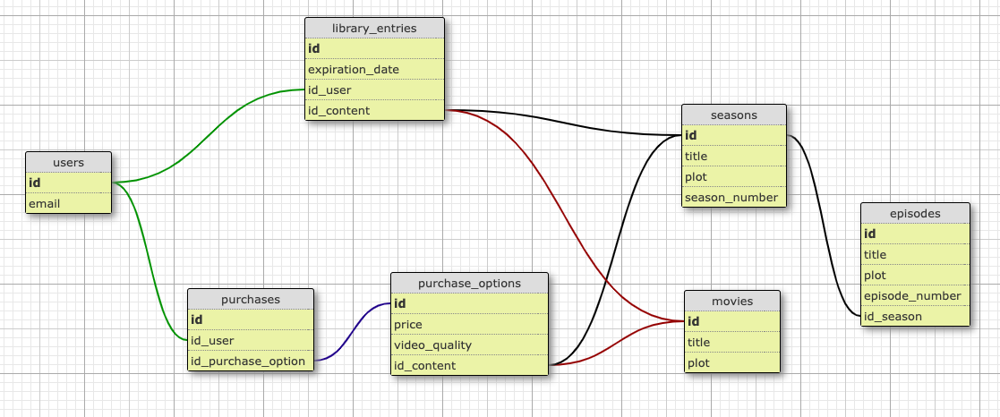

# Streaming Web Application

This is a Ruby on Rails-based streaming web application that allows users to access and purchase movies and seasons. The application also features user libraries to store purchased content, with specific rules for content expiration and restrictions on repurchasing the same content.

## Table of Contents

- [Overview](#overview)
- [Endpoints](#endpoints)
  - [Movies](#movies)
  - [Seasons and Episodes](#seasons-and-episodes)
  - [Combined List of Movies and Seasons](#combined-list-of-movies-and-seasons)
  - [User Purchase](#user-purchase)
  - [User Library](#user-library)

## Overview

The application revolves around three main content types: movies, seasons, and episodes. Each movie and episode has a title and a plot, while seasons also have a season number. Episodes belong to a season and have an episode number within that season.

## Endpoints

### Movies

- **Endpoint:** `/movies`
- **HTTP Method:** GET
- **Description:** Returns a list of movies ordered by creation date.

### Seasons and Episodes

- **Endpoint:** `/seasons`
- **HTTP Method:** GET
- **Description:** Returns a list of seasons ordered by creation date, including the list of episodes ordered by episode number within each season.

### Combined List of Movies and Seasons

- **Endpoint:** `/contents`
- **HTTP Method:** GET
- **Description:** Returns a single combined list of movies and seasons ordered by creation date.

### User Purchase

- **Endpoint:** `/purchase`
- **HTTP Method:** POST
- **Description:** Allows a user to perform a purchase of a movie or season through an available purchase option.

### User Library

- **Endpoint:** `/library/`
- **HTTP Method:** GET
- **Description:** Retrieves the library of a user, displaying the titles of available and unexpired content in their library. The content is ordered by the remaining time for the user to watch it.

## Screenshots

### Database Design

## Conclusion

With this streaming web application, users can easily browse and purchase movies and seasons and enjoy their purchased content within the expiration window. The defined JSON REST API allows smooth integration, making it easier for users to interact with the application and access their libraries.
